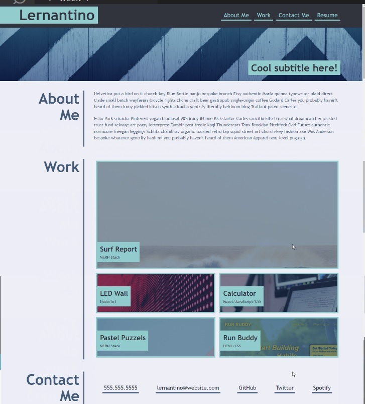

# WebPortfolio

## Unit_2_Challenge_Portfolio-EDx-Bootcamp
Initial Portfolio Project to be updated during course

## Description

- This project will be the showcase for my work during the course and beyond.
- I built this project to develop flexbox grid and @media skills.
- This project helped me learn how to combined different CSS formatting techniques.
- I learned the importance of wrapping semantic elements in divs to provide extra control, but also to ensure that parent/child relationship are not lost.

### Grid Flex Positioning: placing elements and ensuring flexibility for responsive design.

### User Story

```
AS A marketing agency
I WANT a codebase that follows accessibility standards
SO THAT our own site is optimized for search engines
```

### Acceptance Criteria

* When the page is loaded the page presents your name, a recent photo or avatar, and links to sections about you, your work, and how to contact you
* When one of the links in the navigation is clicked then the UI scrolls to the corresponding section
* When viewing the section about your work then the section contains titled images of your applications
* When presented with the your first application then that application's image should be larger in size than the others
* When images of the applications are clicked then the user is taken to that deployed application
* When the page is resized or viewed on various screens and devices then the layout is responsive and adapts to my viewport

* The resulting page should match the following image:



## Installation

This is a basic static front-end website deployment which can be deployed on any server or client with a browser. [The GIThub page deployment](https://essexgit.github.io/WebPortfolio/)

## Credits

All placeholder  images provided by EdX

## Licence
This work is published under the [MIT Licence](./LICENSE)